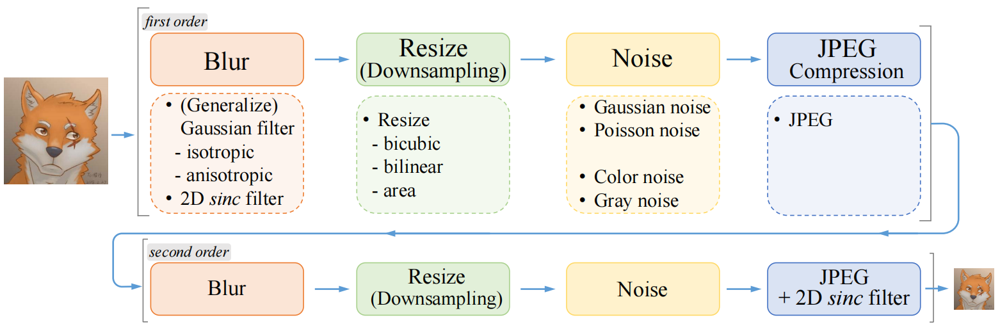

# **该仓库用来记录在超分算法中使用的图像降质算法**

参考地址是[RealESRGAN](https://github.com/XPixelGroup/BasicSR/blob/master/basicsr/data/degradations.py)，为了方便后续使用，因此单独把这套框架里的图像二阶降质算法单独拧出来了，降质过程如下：

该过程主要用于生成超分任务中所需的LR图像，常规的超分算法都是直接对HR图像下采样(但是所训练模型对真实LR图像效果并不好)，因此通过这种方式对HR图像进行降质下采样

原始框架中主要是针对三通道图像进行下采样，对二阶降质算法进行了修改，使其能够对单通道图像也进行下采样

## 1.degradations.py

主要包含高斯、广义高斯、泊松噪声等各种滤波核以及噪声添加算法

## 2.diffjpeg.py

JPEG压缩的相关过程

## 3.generate_kernels.py

根据给定图像和参数生成相应的滤波核kernel1、kernel2、sinc_kernel，分别用在一阶段Blur、二阶段Blur以及最后一步的2D sinc filter中

## 4.utils.py

主要存放了img2tensor和filter2D的实现，其中filter2D中使用的kernel来自generate_kernels.py中生成的滤波核，filter2D用在两个阶段中的Blur和最后的2D sinc fileter中

## 5.model_net.py

示例了一个Model和feed_data函数的使用方式，用于实现上述整个二阶段降质过程

## 6.config.yml

各种降质参数的说明和配置

## 7.使用方式

根据需求修改配置文件

将kernel的生成放在DataSet的过程中，返回{"gt": HR, "kernel1": kernel1, "kernel2": kernel2, "sinc_kernel": sinc_kernel}这样的字典给DataLoader使用

将feed_data放在模型结构中，并关闭该部分的梯度更新。实例化model后，先完成model.feed_data()，拿到LR图像后，再model(LR)

最后，无论是三通道还是单通道图像，灰度值都是0-1

